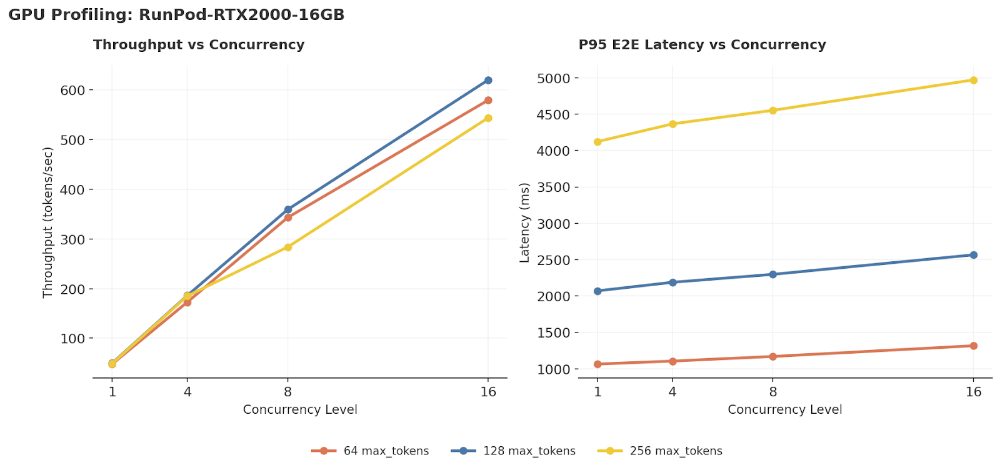

# Day 003 – vLLM Capacity, OOM Surface & Real Use-Cases
## Tier 1: Must-Do Core Block (~2 hours)

> **Prerequisites**: Complete [Day 002](../day-002-GPU-node-bring-up/)  
> **Goal**: Turn your RunPod node into a measured vLLM server for two real workloads  
> **End State**: Reusable configs, benchmark harness, and capacity grid for chat workload  
> **Time**: ~2 hours

---

## 🎯 Core Idea

This exercise is teaching you to think like an inference engineer:to read a single benchmark JSON like an inference engineer: to instantly parse latency (TTFT, E2E), throughput (tpot), and concurrency, and see how they interact.

You want to reach the point where you glance at it and think:

“p95 latency ≈ 2.3 s, concurrency = 8, ~100 tokens/request, ~350 tokens/s overall → this is the box’s capacity and the user experience.”
Turn your RunPod node(s) into **measured**, not "hopeful", vLLM servers for two real workloads:

1. **Latency-optimized chat API** – short turns, interactive user
2. **Throughput-optimized batch summarization** – documents, offline jobs

And, if budget allows, you'll get one A100/H100 anchor to see how the same config scales on "real" inference hardware.

---

## 📊 Key Metrics We'll Measure

| Metric | Definition | Why It Matters |
|--------|------------|----------------|
| **TTFT** | Time to First Token | User perceives "responsiveness" |
| **ITL** | Inter-Token Latency (time between tokens) | Streaming smoothness |
| **TPOT** | Time Per Output Token = `(e2e - ttft) / output_tokens` | Decode efficiency |
| **E2E** | End-to-end latency | Total request time |
| **System TPS** | Total tokens/sec across all requests | Infrastructure capacity |
| **User TPS** | Tokens/sec per user ≈ `1/ITL` | Individual UX |

---

## Tier 1 Tasks (~2 hours)

---

### ✅ Task 1.1: Encode a Reusable vLLM Config for Chat
**Tags**: `[Inference–Runtime]` `[Phase1-vLLM-Baseline]`  
**Time**: 30 min  
**Win**: One clean YAML for "chat on a 16GB-ish GPU" (RTX 2000 / T4 class)

#### 🔧 Lab Instructions

Create the config directory and start vLLM directly (simpler than YAML config):

```bash
mkdir -p ~/configs/vllm

# Create a simple start script (CLI args are more reliable than YAML)
cat > ~/configs/vllm/serve_qwen2p5_1p5b_chat_16gb.sh << 'EOF'
#!/usr/bin/env bash
set -euo pipefail

export HF_HUB_ENABLE_HF_TRANSFER=0

vllm serve Qwen/Qwen2.5-1.5B-Instruct \
  --dtype bfloat16 \
  --host 0.0.0.0 \
  --port 8000 \
  --gpu-memory-utilization 0.8 \
  --max-model-len 4096 \
  --max-num-seqs 128 \
  --enable-prefix-caching \
  --enable-chunked-prefill
EOF

chmod +x ~/configs/vllm/serve_qwen2p5_1p5b_chat_16gb.sh
```

> **Note**: CLI args are more reliable than YAML config files across vLLM versions.

#### 📁 Artifacts
- `~/configs/vllm/qwen2p5_1p5b_chat_16gb.yaml`
- `~/configs/vllm/serve_qwen2p5_1p5b_chat_16gb.sh`

#### 💡 Why This Matters
You now have a **named recipe** for "chat on small GPU", not a pile of CLI flags.

#### 🏆 Success Criteria
- [ ] YAML config created with documented knobs
- [ ] Wrapper script runs without errors
- [ ] Config values match your Day 002 findings

---

### ✅ Task 1.2: Build an Async Chat-Load Benchmark Harness
**Tags**: `[Inference–Runtime]` `[Phase1-LoadTesting]`  
**Time**: 45 min  
**Win**: Measure p50/p95 TTFT + end-to-end latency + rough tokens/sec

#### 🔧 Lab Instructions

First, install the required dependency:

```bash
pip install aiohttp
```

Create the benchmark script:

```bash
mkdir -p ~/scripts/benchmarks ~/benchmarks

cat > ~/scripts/benchmarks/vllm_chat_bench.py << 'EOF'
#!/usr/bin/env python3
"""Simple async benchmark for vLLM. Measures TTFT, E2E latency, throughput."""

import argparse
import asyncio
import json
import statistics
import time
import aiohttp

MODEL = "Qwen/Qwen2.5-1.5B-Instruct"

async def run_single_request(session, url, prompt, max_tokens):
    """Send one request, return (ttft_ms, e2e_ms, output_tokens)."""
    payload = {"model": MODEL, "prompt": prompt, "max_tokens": max_tokens, "stream": False}
    
    t0 = time.perf_counter()
    async with session.post(url, json=payload) as resp:
        t1 = time.perf_counter()  # first byte
        data = await resp.json()
    t2 = time.perf_counter()
    
    # Handle both completion and chat response formats
    if "choices" in data and len(data["choices"]) > 0:
        text = data["choices"][0].get("text", "") or data["choices"][0].get("message", {}).get("content", "")
    else:
        text = ""
    
    ttft_ms = (t1 - t0) * 1000
    e2e_ms = (t2 - t0) * 1000
    out_tokens = len(text.split())  # rough estimate
    
    return ttft_ms, e2e_ms, out_tokens


async def run_benchmark(url, prompt, n_requests, concurrency, max_tokens):
    """Run n_requests with concurrency limit, return stats dict."""
    results = []  # list of (ttft, e2e, tokens)
    sem = asyncio.Semaphore(concurrency)
    
    async def worker():
        async with sem:
            async with aiohttp.ClientSession() as session:
                result = await run_single_request(session, url, prompt, max_tokens)
                results.append(result)
    
    t_start = time.perf_counter()
    await asyncio.gather(*[worker() for _ in range(n_requests)])
    t_end = time.perf_counter()
    
    wall_clock_s = t_end - t_start
    ttfts = [r[0] for r in results]
    e2es = [r[1] for r in results]
    tokens = [r[2] for r in results]
    
    def percentile(vals, p):
        if not vals: return 0.0
        s = sorted(vals)
        return s[min(int(len(s) * p), len(s) - 1)]
    
    total_tokens = sum(tokens)
    
    return {
        "n_requests": n_requests,
        "concurrency": concurrency,
        "max_tokens": max_tokens,
        "wall_clock_s": round(wall_clock_s, 2),
        "p50_ttft_ms": round(statistics.median(ttfts), 2) if ttfts else 0,
        "p95_ttft_ms": round(percentile(ttfts, 0.95), 2),
        "p50_e2e_ms": round(statistics.median(e2es), 2) if e2es else 0,
        "p95_e2e_ms": round(percentile(e2es, 0.95), 2),
        "throughput_tok_s": round(total_tokens / wall_clock_s, 2) if wall_clock_s > 0 else 0,
        "total_tokens": total_tokens,
    }


if __name__ == "__main__":
    parser = argparse.ArgumentParser(description="vLLM Chat Benchmark")
    parser.add_argument("--url", default="http://127.0.0.1:8000/v1/completions")
    parser.add_argument("--n-requests", type=int, default=32)
    parser.add_argument("--concurrency", type=int, default=8)
    parser.add_argument("--max-tokens", type=int, default=128)
    args = parser.parse_args()
    
    prompt = "Explain the trade-offs between max_model_len and max_num_seqs for vLLM serving in 3 sentences."
    
    result = asyncio.run(run_benchmark(
        url=args.url,
        prompt=prompt,
        n_requests=args.n_requests,
        concurrency=args.concurrency,
        max_tokens=args.max_tokens,
    ))
    print(json.dumps(result, indent=2))
EOF

chmod +x ~/scripts/benchmarks/vllm_chat_bench.py
```

#### 🧪 Run the Benchmark

Terminal 1 – Start vLLM:
```bash
~/configs/vllm/serve_qwen2p5_1p5b_chat_16gb.sh
```

Terminal 2 – Run benchmark:
```bash
python ~/scripts/benchmarks/vllm_chat_bench.py \
  --n-requests 32 --concurrency 8 --max-tokens 128 \
  > ~/benchmarks/day003_chat_baseline_rtx16gb.json

cat ~/benchmarks/day003_chat_baseline_rtx16gb.json
```

#### 📁 Artifacts
- `~/scripts/benchmarks/vllm_chat_bench.py`
- `~/benchmarks/day003_chat_baseline_rtx16gb.json`

#### 🏆 Success Criteria
- [ ] Benchmark script runs without errors
- [ ] JSON output contains TTFT, TPOT, E2E, and throughput metrics
- [ ] Results saved to benchmarks directory

<details>
<summary><strong>📚 Understanding the Metrics</strong></summary>

| Metric | Formula | Good Value (Chat) |
|--------|---------|-------------------|
| **TTFT** | Time until first token arrives | < 200ms |
| **TPOT** | `(e2e - ttft) / output_tokens` | < 50ms |
| **ITL** | Time between consecutive tokens (streaming) | < 50ms |
| **System TPS** | `total_tokens / wall_clock_time` | Higher = better |
| **User TPS** | `≈ 1000 / TPOT_ms` | > 20 tok/s |

**Why TPOT matters**: TPOT captures decode efficiency. High TPOT = slow token generation = poor streaming UX.

**System vs User TPS**:
- System TPS = total capacity (how many tokens/sec your GPU produces)
- User TPS = what one user experiences (degrades under load)

</details>

**Conclusion**:
This exercise is training you to look at a benchmark JSON and instantly form a mental picture of the system. For example, if you see `p95_ttft_ms ≈ p95_e2e_ms ≈ 2300` with 8 concurrent requests, you conclude there is effectively no streaming: users wait about 2.3 seconds and then get the full answer at once. If you see `total_tokens = 3210`, `wall_clock_s = 9.15`, and `concurrency = 8`, you compute `throughput_tok_s ≈ 350` and infer that one RTX 2000 Ada can comfortably handle 8 concurrent chatty users at ~100 tokens per request within a ~3 second p95 SLO. If you later crank concurrency to 32 and see throughput barely increase while p95 latency jumps to 9–10 seconds, you immediately know you’ve entered queuing hell and need to cap concurrency. Conversely, if you see tiny p95 latencies (say 100 ms) and very low throughput on a big GPU, you know the GPU is underutilized and could either host more workloads or be downgraded. And if you increase `max_tokens` from 128 to 512 and E2E doubles while TTFT stays flat, you recognize that you’ve shifted the bottleneck into pure generation compute and may want to lower max tokens to buy back capacity. All of this is about turning TTFT, E2E, tpot, and concurrency into quick, almost reflexive judgments about user experience, capacity, and the next knob to turn. 

As you get comfortable with that, the next step is to layer in richer latency and throughput metrics so you’re not just saying “it’s slow,” but why it’s slow. You start watching p95/p99 TTFT and E2E separately for interactive paths (chat, UI buttons) versus background jobs (long summaries), and you break E2E into queue time, pure model compute time, and network overhead so you can tell whether you need more GPUs, better batching, or just saner concurrency limits. On the GPU side you track prefill and decode speed in tokens/sec, plus effective batch sizes, to see if you’re actually using the hardware efficiently or just burning money with batch=1 everywhere. In a typical enterprise setup this translates to: tight TTFT and p95 E2E SLOs for chat (fast streaming, capped concurrency), and more relaxed but throughput- and cost-oriented SLOs for offline jobs (heavy batching, longer sequences). The point is that an inference engineer doesn’t just read “2.3 s, 350 tok/s” — they immediately map those numbers to UX guarantees, capacity per GPU, likely bottlenecks (queue vs compute), and concrete actions like “enable streaming,” “lower max_tokens,” “cap concurrency at 16,” or “consolidate models onto fewer cards.”


---

### ✅ Task 1.3: Map a Chat-Capacity Grid on Your GPU
**Tags**: `[Inference–Runtime]` `[Phase1-LoadTesting]`  
**Time**: 45 min  
**Win**: Find a safe-ish zone for chat on your current RunPod GPU

#### 🎯 What This Practice Is Called

This is **Capacity Planning via Throughput-Latency Characterization** — a core inference engineering skill.

In Task 1.2 you built a tool that produces **one data point**. Here you systematically sweep the parameter space (concurrency × output length) to **map the entire capacity envelope** of your GPU. The goal is to answer: *"Given a p95 latency budget of X ms, what's the maximum concurrency I can sustain?"*

This produces a **throughput-latency frontier** — the curve showing where your system saturates and where latency becomes unacceptable. Every production inference deployment needs this data to set safe operating points, and it's what separates "I deployed a model" from "I understand my system's capacity."

#### 🔧 Lab Instructions

Create the grid sweep script:

```bash
cat > ~/scripts/benchmarks/run_chat_capacity_grid.sh << 'OUTER'
#!/usr/bin/env bash
set -euo pipefail

URL="${URL:-http://127.0.0.1:8000/v1/completions}"
OUT_CSV="${OUT_CSV:-$HOME/benchmarks/day003_chat_capacity_rtx16gb.csv}"
GPU_NAME="${GPU_NAME:-RTX-16GB}"

mkdir -p ~/benchmarks

echo "gpu,concurrency,max_tokens,p50_ttft_ms,p95_ttft_ms,p50_e2e_ms,p95_e2e_ms,throughput_tok_s" > "$OUT_CSV"

for conc in 1 4 8 16; do
  for maxtok in 64 128 256; do
    echo "[*] Testing: concurrency=$conc, max_tokens=$maxtok"
    
    # Run benchmark and save JSON
    python ~/scripts/benchmarks/vllm_chat_bench.py \
      --url "$URL" \
      --n-requests 16 \
      --concurrency "$conc" \
      --max-tokens "$maxtok" \
      > /tmp/bench_result.json
    
    # Parse JSON and append CSV row
    python3 -c "
import json
with open('/tmp/bench_result.json') as f:
    d = json.load(f)
print(f\"$GPU_NAME,$conc,$maxtok,{d['p50_ttft_ms']},{d['p95_ttft_ms']},{d['p50_e2e_ms']},{d['p95_e2e_ms']},{d['throughput_tok_s']}\")
" >> "$OUT_CSV"
    
  done
done

echo ""
echo "[✓] Results: $OUT_CSV"
cat "$OUT_CSV"
OUTER

chmod +x ~/scripts/benchmarks/run_chat_capacity_grid.sh
```

#### 🧪 Run the Grid

With vLLM serving in another terminal:

```bash
GPU_NAME="RunPod-RTX2000-16GB" ~/scripts/benchmarks/run_chat_capacity_grid.sh
```

#### 📝 Document Findings

```bash
mkdir -p ~/artifacts

cat > ~/artifacts/day003_chat_capacity_notes.md << 'EOF'
# Day 003 – Chat Capacity Notes

## GPU: [YOUR GPU NAME]
## Model: Qwen/Qwen2.5-1.5B-Instruct (BF16)
## Config: gpu_memory_utilization=0.8, max_model_len=4096, max_num_seqs=128

## Best Combinations (high throughput, reasonable p95)

| Concurrency | max_tokens | p95 E2E (ms) | Throughput (tok/s) | Notes |
|-------------|------------|--------------|--------------------| ------|
| [FILL] | [FILL] | [FILL] | [FILL] | Sweet spot |
| [FILL] | [FILL] | [FILL] | [FILL] | Still acceptable |

## Jitter / Unstable Zone

| Concurrency | max_tokens | Issue |
|-------------|------------|-------|
| [FILL] | [FILL] | p95 spiked to X ms |

## Key Observations

1. [YOUR OBSERVATION]
2. [YOUR OBSERVATION]
3. [YOUR OBSERVATION]

EOF

echo "Edit ~/artifacts/day003_chat_capacity_notes.md with your findings"
```

#### 📁 Artifacts
- `~/scripts/benchmarks/run_chat_capacity_grid.sh`
- `~/benchmarks/day003_chat_capacity_rtx16gb.csv`
- `~/artifacts/day003_chat_capacity_notes.md`

---

#### 📊 Findings: RunPod RTX 2000 Ada 16GB

**Big picture**: This RTX 2000 16GB delivers ~50 tok/s single-stream and up to ~620 tok/s at concurrency 16 with ~2.6s p95 for 128-token replies. That's a perfectly decent "small GPU chat box".

##### Raw Data

```csv
gpu,concurrency,max_tokens,p50_ttft_ms,p95_ttft_ms,p50_e2e_ms,p95_e2e_ms,throughput_tok_s
RunPod-RTX2000-16GB,1,64,  1033.65,1064.54,1033.7, 1064.63, 48.1
RunPod-RTX2000-16GB,1,128, 2060.37,2071.18,2060.42,2071.26, 49.98
RunPod-RTX2000-16GB,1,256, 4004.2, 4123.1, 4004.25,4123.17, 49.16
RunPod-RTX2000-16GB,4,64,  1099.25,1105.87,1099.28,1105.9,  172.94
RunPod-RTX2000-16GB,4,128, 2174.82,2189.45,2174.87,2189.48, 186.25
RunPod-RTX2000-16GB,4,256, 4222.99,4367.22,4223.05,4367.26, 185.26
RunPod-RTX2000-16GB,8,64,  1147.17,1169.38,1147.21,1169.39, 343.22
RunPod-RTX2000-16GB,8,128, 2276.85,2298.28,2276.92,2298.3,  359.27
RunPod-RTX2000-16GB,8,256, 3334.16,4553.77,3334.22,4553.79, 283.75
RunPod-RTX2000-16GB,16,64, 1315.41,1316.46,1315.43,1316.48, 579.74
RunPod-RTX2000-16GB,16,128,2564.09,2566.57,2564.13,2566.61, 620.4
RunPod-RTX2000-16GB,16,256,4959.24,4972.16,4959.28,4972.19, 544.15
```

##### Visualization



*Left: Throughput scales near-linearly up to concurrency=8, then diminishing returns. Right: p95 latency stays remarkably stable for 64/128 tokens, but 256 tokens shows higher baseline latency.*

##### Key Patterns Observed

**1. TTFT ≈ E2E everywhere**

For every row, `p50_ttft_ms ≈ p50_e2e_ms`. This means:
- Streaming is not enabled (or only flushed at the end)
- UX: users see nothing for ~1–5s, then the full answer at once
- **Biggest UX win**: enable true streaming to get TTFT down to a few hundred ms

**2. Single-stream baseline: ~50 tok/s**

At concurrency=1, decode rate is constant regardless of output length:

| max_tokens | E2E (ms) | Throughput |
|------------|----------|------------|
| 64 | ~1030 | 48 tok/s |
| 128 | ~2060 | 50 tok/s |
| 256 | ~4000 | 49 tok/s |

Latency doubles when you double `max_tokens` — pure decode-bound behavior.

**3. Concurrency scaling efficiency**

At `max_tokens=128`:

| Concurrency | Throughput | Scaling | Efficiency |
|-------------|------------|---------|------------|
| 1 | 50 tok/s | 1× | — |
| 4 | 186 tok/s | 3.7× | 93% |
| 8 | 359 tok/s | 7.2× | 90% |
| 16 | 620 tok/s | 12.4× | 78% |

Continuous batching is working well. 4–8 concurrent is very healthy; 16 starts hitting limits but still delivers.

**4. Latency vs concurrency trade-off is mild**

At `max_tokens=128`:

| Concurrency | p95 E2E | Delta |
|-------------|---------|-------|
| 1 | 2.07s | — |
| 4 | 2.19s | +6% |
| 8 | 2.30s | +11% |
| 16 | 2.57s | +24% |

No queuing hell — even at 16 concurrent, latency only increases ~25%.

**5. Longer sequences hurt throughput at high concurrency**

At `concurrency=8`:
- 64 tokens → 343 tok/s
- 128 tokens → 359 tok/s ✓ (sweet spot)
- 256 tokens → 284 tok/s (drops)

Sweet spot is around `max_tokens=128`; 256 pushes into a regime with less throughput and higher latency.

##### Inference Engineer Evaluation

If you define a chat SLO like:
- p95 TTFT ≤ 1.0–1.5s (with real streaming)
- p95 E2E ≤ 3.0s
- typical reply length ≤ 128 tokens

Then:

| Use Case | Config | p95 E2E | Throughput |
|----------|--------|---------|------------|
| **Interactive chat** | conc=8–12, max_tokens=128 | ~2.3–2.6s | 360–620 tok/s |
| **Heavy tasks** (summaries) | conc=8–16, max_tokens=256 | ~4.3–5.0s | 280–544 tok/s |

##### Concrete Config Recommendations

**Default chat endpoint:**
```yaml
max_tokens: 128
target_concurrency_per_gpu: 8-12  # 16 is fine, 8 is very safe
streaming: true  # so TTFT < 1s
slo_p95_e2e: 3s
```

**Heavy-task endpoint (summaries, longer outputs):**
```yaml
max_tokens: 256+
concurrency: 8-16
slo_p95_e2e: 5s  # relaxed
optimize_for: tokens_per_dollar
```

**Scaling trigger:**
- When p95 E2E for chat consistently > 3s at target concurrency → scale out
- Use ~600 tok/s @ conc=16 as "capacity per GPU" for planning

##### Capacity Statement

> *"This RTX 2000 Ada 16GB can comfortably serve 8–16 concurrent chat users generating ~128 tokens each, with p95 latency under 2.6 seconds and system throughput of ~620 tok/s."*

---

#### 💡 Why This Matters
You now have **measured chat capacity** for a given GPU – not vibes. This already puts you closer to the top 1% than most practitioners.

#### 🏆 Success Criteria
- [ ] Grid sweep completed for all concurrency × max_tokens combos
- [ ] CSV saved with all results
- [ ] Notes file documents best combos and jitter zones

---

## Tier 1 Summary

| Task | What You Did | Status |
|------|--------------|--------|
| **1.1** | Created reusable vLLM YAML config for chat | ⬜ |
| **1.2** | Built async benchmark harness | ⬜ |
| **1.3** | Mapped chat capacity grid | ⬜ |

### Artifacts Created
```
~/configs/vllm/
├── qwen2p5_1p5b_chat_16gb.yaml
└── serve_qwen2p5_1p5b_chat_16gb.sh

~/scripts/benchmarks/
├── vllm_chat_bench.py
└── run_chat_capacity_grid.sh

~/benchmarks/
├── day003_chat_baseline_rtx16gb.json
└── day003_chat_capacity_rtx16gb.csv

~/artifacts/
└── day003_chat_capacity_notes.md
```

---

**→ Continue to [Tier 2](LOG_tier02.md)**: Batch summarization workload + A100/H100 anchor run
