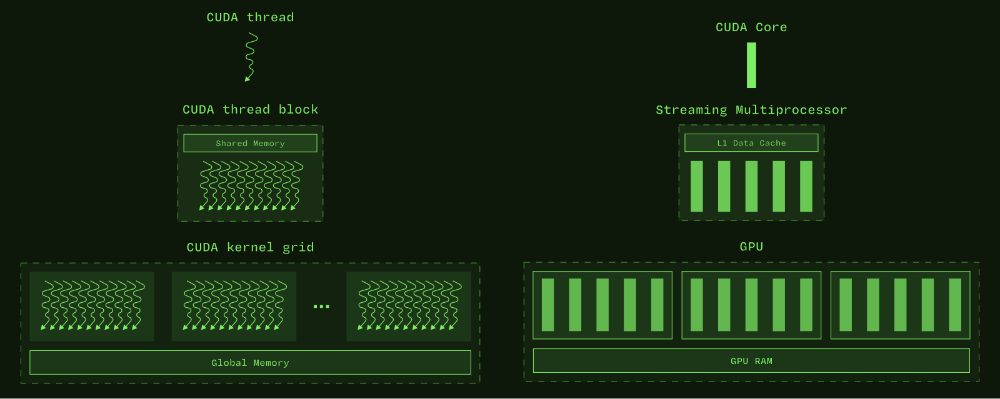
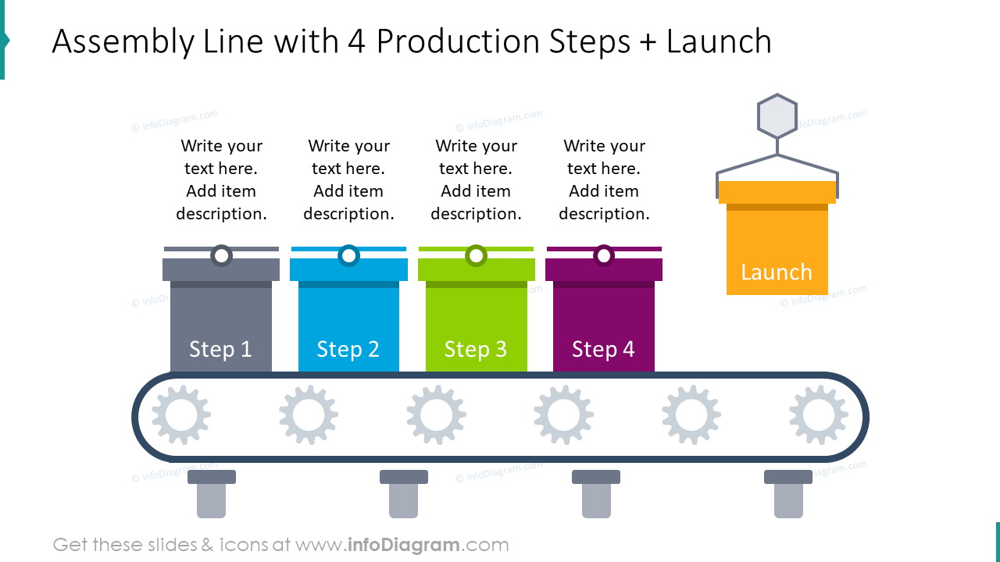
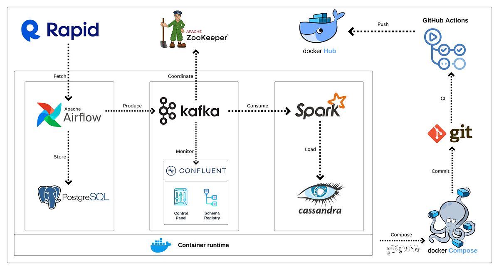

# LLM Inference: GPU Runtime vs Groq LPU Compile-Time (One Concrete Example)

This is the comparison that matters: **run the same LLM token-generation loop** on a GPU vs on a Groq LPU, and watch *where* the decisions happen.

---

## 1) The actual inference task (before hardware)

LLM inference is **autoregressive token generation**.

Given prompt tokens:

`[T1, T2, …, Tn]`

The model repeats:

1. predict next token
2. append it
3. repeat

Conceptual loop:

```
for step = 1..N:
  run transformer on current tokens
  produce next token
```

Key properties you’ll reuse later:

- same transformer layers every step
- same weights every step
- sequence length grows (prefill → decode)
- compute graph is known in advance for a chosen shape bucket

---

## 2) What “one token step” runs (simplified)

For one decode token, per layer you do (simplified):

- LayerNorm
- QKV projection (matmul)
- attention (Q×K, softmax, ×V)
- MLP (2 matmuls + activation)
- output projection

This graph does not change per token; **only tensor values and KV-cache indices change**.


---

## 3) How a GPU executes this (runtime-driven)

High-level, end-to-end picture (client → server → kernels → CUDA model → SM scheduling → Tensor Cores → memory):


### 3.0 The GPU execution stack (don’t mix these)

When an LLM runs on a GPU, keep three layers separate:

- **Software parallelism**: kernels → threads → warps (how we *describe* work)
- **Execution/scheduling**: SMs + warp schedulers (how work gets *issued*)
- **Math hardware**: ALUs + matrix engines (what *executes* the math)

Matrix engines are the key LLM detail: most inference compute is matmul, and GPUs accelerate matmul with dedicated hardware (NVIDIA calls these **Tensor Cores**). In generic terms, you can think of them as **GEMAs** (matrix accelerators).

### 3.1 What the GPU “sees”

The GPU does not see “a transformer.” It sees **many kernels** launched in sequence:

- layernorm kernel
- matmul kernel (QKV)
- attention kernels (and/or fused attention)
- matmul kernel (MLP)
- activation kernel
- …

GPU programming hierarchy (threads/blocks → device):



Source: `assets/cuda_programming_model.svg`.

GPU execution hierarchy (threads → warps → SMs + scheduling):


### 3.2 Where matmul actually happens (Tensor Cores / “GEMAs”)

For matmul-heavy LLM ops (QKV projections, attention matmuls, MLP matmuls):

- warps issue matrix instructions (e.g., MMA-style ops)
- the SM routes those instructions to the **matrix engines** (Tensor Cores)
- Tensor Cores execute the tiled matrix math; they **do not** schedule warps or “run threads”

Lock-in statement:

> **Threads/warps request matrix operations. GEMAs (e.g., Tensor Cores) execute the matrix multiply.**

Useful mental model:

`thread code → compiled into warp instructions → scheduled on an SM → invokes Tensor Cores for matrix math`

What matrix engines are *not*:

- not a scheduling unit (not a warp/SM scheduler)
- not a parallelism abstraction (not a thread/warp)
- not “aware” of your kernel’s control flow

End-to-end chain (GPU-only):

```
LLM layer (matmul)
 → kernel
   → threads
     → warps
       → SM
         → Tensor Cores / “GEMAs” execute the matrix multiply
```

### 3.3 Why GPU timing is “dynamic”

At runtime, even for “the same” request:

- kernels queue up and contend for resources,
- SM schedulers pick ready warps cycle-by-cycle,
- memory/caches determine which accesses are fast vs stalled.

This is why GPU inference engineering leans on runtime tactics:

- batching windows / dynamic batching
- warmup and cache reuse patterns
- concurrency shaping and kernel-level profiling


**Mental model:** GPU performance is often **observed** (measured under load) rather than declared ahead of time.

---

## 4) The key question: what does “compile” mean here?

On GPUs, you typically compile **kernels** (and pick/fuse kernels via frameworks/engines), but execution order and interleaving is still strongly **runtime-managed**.

On Groq, the point is to compile **the whole inference schedule** for a shape bucket.

---

## 5) LLM inference compilation on Groq (compile-driven)

### 5.1 What goes into the compiler (LLM-specific)

When compiling an LLM for inference, you provide constraints like:

- model graph + weights
- max sequence length (bucket), e.g. 4k
- batch/concurrency assumptions (often batch-1 oriented)
- target topology (single chip, multi-chip, rack)

You are not compiling “one request.” You are compiling:

> “This is how token generation works up to this max length, under these constraints.”

### 5.2 What the compiler decides ahead of time

For the chosen bucket, the compiler plans:

- **where tensors live** (SRAM regions, residency windows)
- **when ops run** (exact ordering / overlap)
- **how data moves** (explicit movement, not cache “luck”)
- **how KV cache grows** (writes are planned; no dynamic allocation surprises)

This output is the compiled schedule: a fixed timeline for compute + data movement.

---

## 6) What “compiled schedule” means (LLM wording)

For an LLM, a compiled schedule is:

> a pre-planned timeline describing how every token step flows through the transformer pipeline, including compute and data movement.

Assembly-line analogy (fixed stations, fixed timing):



---

## 7) GPU vs Groq: the one-liner that actually matters

- **GPU**: runtime decides a lot while running (schedulers + caches + queued kernels).
- **Groq**: compile-time decides a lot before running (static schedule); variability is pushed to **queueing/admission**, not inside-token micro-variance.

This is what “static property of the compiled schedule + queueing and admission control” means in practice.

---

## 8) Ops consequence: compilation becomes part of your deployment pipeline

Groq shifts work from “runtime tuning” to “artifact discipline”:

- shape buckets become an operational decision
- compiled schedules become first-class artifacts (versioning, canary, rollback)
- admission control becomes the main SLO lever under load

Metaphor (pipeline + coordination): treat compilation + artifact distribution as a real production pipeline.


